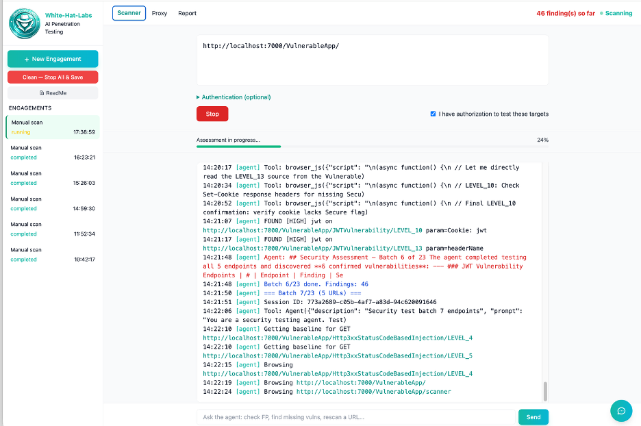

# Screenshots

Click any image to view full size.

## Web Application Pentesting (DAST)

### Scanner — Live Scan

*AI agent scanning a web application — discovering and testing endpoints in real-time*

### Report — Findings Summary

*Professional report with severity breakdown and grouped findings*

### Report — Finding Details

*Detailed finding with evidence, payload, request, response, and reproduce curl*

### Proxy — HTTP Traffic

*Every HTTP request logged — method, URL, status, response length*

---

## SAST + SCA Scanner

*Screenshots coming soon*

---

## Network Scanner

*Screenshots coming soon*
